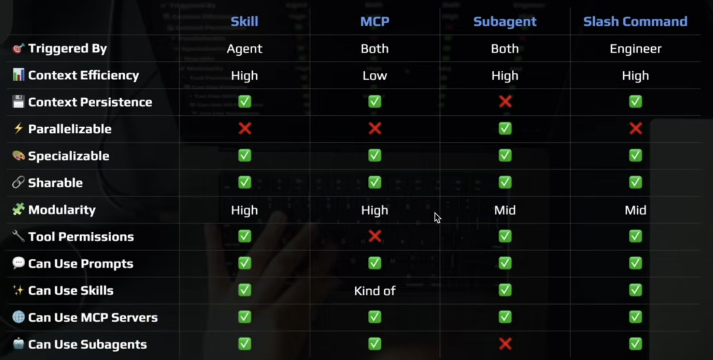
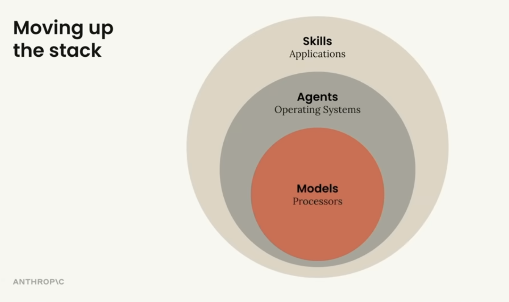
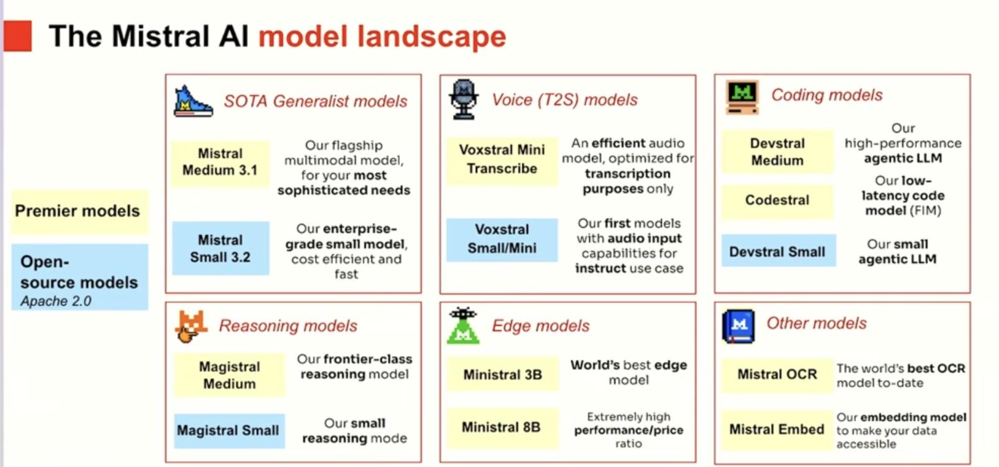

# Inspiration
This project is inspired by a discussion with Nuttee and through my observation of area for improvement of onboarding experiences.

# Disclaimer
This project is unofficial and not endorsed by Datadog.

# Problem Statement
The objective of this project is to reduce friction and time-to-value when prospects evaluate Datadog during a PoC, with a specific focus on agent and SDK instrumentation. From a prospect’s perspective, onboarding friction often comes from unfamiliar instrumentation patterns and the cognitive load of navigating extensive documentation.

# My Writing: Prospects' Experience
I must assume that the Datadog users don't have Claude Code, OpenCode, Codex, Cursor, or other similar AI coding tools (but would have internet access). If she has one of the mainstream coding tools, then she would be importing the SKILLS (or Datadog Onboarding MCP Server) and the relevant Claude Code's commands. If she doesn't have one of the mainstream coding tools, then she needs a portable (NO INSTALLATION) and light-weight AI coding tool that works with Windows, Mac, and Linux like Claude Code or OpenCode. Additionally, she would need access to a LLM model. So for a start of this project, I could provide my own OpenRouter API Key at my own expense. But to keep cost sustainable, I am considering using llama.cpp (portable with no installation) for this project.  

# My Writing: Considerations
To get the instrumentation context, one can use Datadog Onboarding MCP Server or a Claude Code SKILLS that offers content on Datadog Docs (the latter is currently unavailable so I need to build it). But why think about building something if Datadog Onboarding MCP Server is currently available?

So using SKILLS is similar to using Datadog Docs through Datadog MCP Sever. Alternatively, using SKILLS is similar to using Datadog Public Website Doc via Claude Code internet search. 

So what is the value of using SKILLS for content from Datadog Docs to instrument (instead of using Datadog Docs via Internet search or Datadog MCP Server)? Also can't we just use Datadog Github Docs repo https://github.com/DataDog/documentation/blob/master/content for instrumentation instead? 

To answer this loaded question:

1. Using the Datadog MCP Server requires authentication from Datadog using Datadog account. For me that is a blackbox right now. https://app.datadoghq.com/rum/list/create-agentic and the MCP Sever URL is https://mcp.datadoghq.com/api/unstable/mcp-server/mcp?toolsets=onboarding 

2. Though the Datadog GitHub Doc repo ttps://github.com/DataDog/documentation/blob/master/content represents the latest content, but in raw form it is too broad and inefficient for Claude Code consumption without additional structure like SKILLS. 

3. Using the Claude Code internet search, then it might require at least one internet hop to get to the Datadog Github Docs https://github.com/DataDog/documentation/blob/master/content which might not be efficiency and accurate. The accurate is key here. 

In summary - besides using the Datadog MCP Server unaddressed - using SKILLS referencing the content from Datadog Github Docs repo offers reliable efficiency and accuracy for developers instrumenting Datadog agents, SDKs, or both. Utimately, the objective of this project is to make adopting Datadog agents and SDKs onboarding easier and faster.

How about maintainiung of this project? It should be designed to be easy such that as the Datadog Docs get updated, it would be updated whenver it is updated. Then do we have to fork the Datadog Github Docs repo github.com/DataDog/documentation/blob/master/content  or can I just setup another repo with a custom code to crawl the Datadog Github Doc repo regularly? I prefer forking it but how do we maintain a folder called skills with several subfolders of skill names each with a SKILL.md in it while referencing the the latest content in github.com/DataDog/documentation/blob/master/content? TODO: Research how to do this.

Source courtesy: IndyDevDan

Source courtesy: Anthropic employees' talk at DeepLearning.ai conference

# My Writing: What I found on the internet
There are companies who test using AI to assist in instrumentation and [the result hasn't been good](https://quesma.com/blog/introducing-otel-bench/). So, I'm interested to see how this commercial business makes their [AI assisted OTel instrumentation work well](https://ollygarden.com/rose). 

# ChatGPT Writing: Maintenance Recommendation
The maintenance goal is eventual consistency with Datadog documentation rather than strict real-time parity. SKILLS should live in a separate repository and rely on automation to track relevant upstream documentation, update curated content when changes occur, and preserve SKILLS-specific structure and annotations. Forking the Datadog documentation repository is unnecessary and would introduce avoidable maintenance overhead, whereas automated extraction or referencing provides better long-term sustainability.

# ChatGPT Writing: Why SKILLS Instead of the MCP Server
SKILLS do not replace the Datadog Onboarding MCP Server but provide a developer-controlled and transparent alternative that is more suitable for proof-of-concept tooling and experimentation. Unlike the MCP Server, SKILLS do not require Datadog authentication, do not operate as a black box, and can be inspected, extended, and adapted as part of an open workflow.

# ChatGPT Writing: Why SKILLS
SKILLS are not an alternative documentation source but a curated and structured interface over existing Datadog documentation. They transform raw documentation into scoped, opinionated knowledge aligned with onboarding and instrumentation workflows. By filtering irrelevant content, stabilizing prompts, and structuring guidance around concrete tasks, SKILLS reduce hallucination risk, improve token efficiency, and increase accuracy. The core value lies in this transformation layer, rather than in the underlying documentation itself.

# Other Reference

Source courtesy: Mistral employee at DeepLearning.ai conference

# My Writing: Project Objective
The objective of this project is not to reinvent the wheel but to empower users to instrument Datadog agent and SDK onboarding easier and more approachable during PoC evaluations by providing a list of functional requirements (in the form of success criteria) for the AI-assisted instrumentation to support my work.

---

# Before 17 Feb 2026 Section

# opencode-fork-noinstall script
It should NOT have intrusive behaviors such as:

1. Automatically modifies shell configs (~/.bashrc, ~/.zshrc) - writes to your files
2. Fixed installation path (~/.opencode/bin) - no flexibility
3. Creates directories without asking
4. Version checking connects to GitHub API
5. No dry-run mode - can't preview what it will do

# Next
Get prospect (or even friends) using it first. Start with a portable OpenCode or Claude Code without installation on Linux or Windows. Then add Datadog Onboarding MCP with commands and test its accuracy.

---

# After 17 Feb 2026 Section

# Project Components
To achieve the goal with the current SOTA components I would need:
1. Coding Agent CLI: OpenCode or Claude Code
2. Small Language Model: llama.cpp with a local model from Unsloth recommendation; but start with a free online model first using OpenRouter
3. Agents: < Reference Terminus Bench Agents work>
4. Skills: Datadog Docs
5. PoC Requirements

# I. Start with Basic Test Driven Development

## A. Infrastructure Monitoring Test Cases:
1. Add Datadog Agent to a host
    * It should be able to differentiate between Windows, Linux, and other OS.
    * It should be able to differentiate between CentOS, RHEL, Ubuntu, and other distro.
    * It should be able to differentiate between support and unsupported versions of distro.
    * It should be able to ask for any additional information it requires to proceed further such as datadog api key and site if it was not provided
    * It should be able to install the latest or correct version of Datadog Agent according to the OS and distro as well as version
    * It should be able to validate the datadog agent status and verify the datadog agent process is runnin
    * It should be able to test Datadog API endpoint to verify if the host metrics are available to validate it instrumented correctly
    * It should be able to use git state (regardless available or unavailable)  to track Datadog Agent right after installation.
    * It should be able to perform custom config changes, check agent status is active (not error), and commit git changes locally.
    * It should be able to write each step it has taken to a markdown file.
2. Add DDOT (with Datadog Agent) to a host
    * Same as above
3. (OPTIONAL) Add OTel Col (contrib) to a host 
    * Same as above

## B. Application Performance Monitoring Test Cases:
1. Add Datadog Trace SDK to an application
    * It should be able to differentiate between Java, .NET, and other programming languages. 
    * It should be able to differentiate between support and unsupported versions of programming languages.
    * It should be able to differentiate between Springboot, Nest.js, and other framework.
    * It should be able to differentiate between support and unsupported versions of framework.
    * It should be able to use git state (regardless available or unavailable) to track Datadog Trace SDK right after addition.
    * It should be able to perform manual instrumentation, working status of application using README.md, and commit git changes locally.
    * It should be able to ask for any additional information it requires to proceed further such as datadog api key if it was not provided
    * It should be able to write each step it has taken to a markdown file.
2. (OPTIONAl) Add OTel SDK to an application
    * Same as above    

## C. Real User Moniotoring Test Cases:
1. Add Datadog Browser RUM SDK to an application
    * Same as APM test cases

# II. Progress to Intermediate Test Drive Development
## A. Troubleshoot host instrumentation failures
    * Send test metrics, traces, and logs from script to Datadog
    * Send test metrics, traces and logs through Datadog Agent
    * Send test metrics, traces and logs through DDOT (with Datadog Agent)
    * (OPTIONAL) Send test metrics, traces, and logs through OTel Col (contrib)
    * Ask for any additional information it requires to proceed further such as datadog api key if it was not provided
    * Write each step it has taken to a markdown file.
## B. Troubleshoot BE application instrumentation failures
    * Send test metrics, traces, and logs from script to Datadog
    * Send test metrics, traces, and logs from Datadog Trace SDK to Datadog Agent
    * (OPTIONAL) Send test metrics, traces, and logs from OTel SDK to Datadog
    * Ask for any additional information it requires to proceed further such as datadog api key if it was not provided
    * Write each step it has taken to a markdown file.
## C. Troubleshoot FE application instrumentation failures
    * ...

# III. Progress to Advanced Test Driven Development
## A. PoC plans
    * ...
 
# Todo: Jek
1. Spin up a EC2 Ubuntu, use OpenCode with GLM-5 or Kimi K2.5 (without instruct or thinking) models from OpenRouter, and start with Test Case IA1 with the following prompt: "Monitor this host with Datadog Agent"
    * x86 <> Ubuntu 24 <> OpenCode <> OpenRouter GLM-4.7-Flash
        - It was able to check the OS Distribution
        - It checked check if existing datadog config existed but I am not sure if it is useful step.
        - It was able to ask me for my Datadog API Key but it didn't ask me for my Datadog Site.
        - It was able to install Datadog Agent but it installed an old version Datadog Agent v6. The latest is v7.
        - But it is not sending telemetry to Datadog.
        - After which, I asked it to troubleshoot and it went into recursive state of trying to troubleshoot. 
        - XXX FAILED
        - Verdict: At least OpenCode (unlike Cladue Code) got Datadog Agent wrong version installed - can we make up for model's gap with SKILLS and AGENTS?
    * x86 <> Ubuntu 24 <> OpenCode <> OpenRouter Claude Haiku 4.5 & Claude Sonnet 4.6 models
        - Give it a try if time permits
    * x86 <> Ubuntu 24 <> Claude Code <> OpenRouter GLM-4.7-Flash
        - It was able to check the OS Distribution
        - It checked check if existing datadog config existed but I am not sure if it is useful step.
        - It was able to ask me for my Datadog API Key but it didn't ask me for my Datadog Site.
        - It tried to install Datadog Agent but ran into permission issue and recursive loops trying to solve something
        - It was NOT able to install Datadog Agent
        - It did NOT send telemetry to Datadog
        - XXX FAILED
        - Verdict: Claude Code is not as good as OpenCode when used with OpenRouter GLM-4.7-Flash. So, do NOT use Claude Code with non-Claude models.
    * x86 <> Ubuntu 24 <> Claude Code <> OpenRouter Claude Haiku 4.5 & Claude Sonnet 4.6 models
        - Note: Claude Code is just to benchmark not to be used ultimately because it is proprietary
        - It was able to ask me for my Datadog Site and Datadog API Key
        - It was able to check Datadog status agent
        - It was able to install Datadog Agent the latest version v7.
        - Outcome: Sending telemetry to Datadog
        - VVV PASSED but it was using Claude Haiku 4.5 and Claude Sonnet 4.6 models. So not a clear comparison
        - Verdict: Claude Code is designed to work with Claude models, period.
    * x86 <> Ubuntu 24 <> Codex <> OpenRouter GLM-4.7-Flash 
        - Note: Codex maybe open source. Also its installation is not native like Claude Code or OpenCode
        - Next up
    * x86 <> Ubuntu 24 <> Gemini CLI <> OpenRouter GLM-4.7-Flash 
2. Evaluate the efficacy of the task such that it should ask or instruct me to add datadog api key
3. If it works then evaluate with Test Case IA1 sub points sequentially then to IA2... IC1... IIA... IIC...

